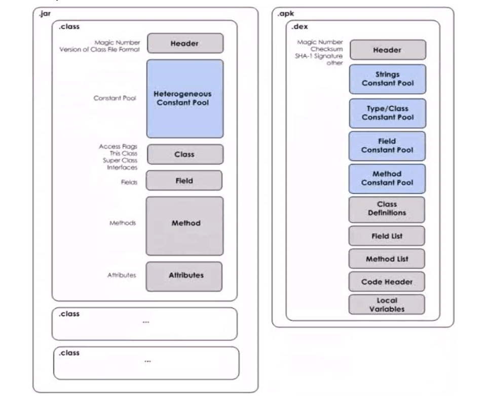

### Dalvik虚拟机相关
> [*Dalvik虚拟机*](https://zh.wikipedia.org/wiki/Dalvik%E8%99%9A%E6%8B%9F%E6%9C%BA)
是 Dalvik Virtual Machine 的缩写，安卓虚拟机
DVM 是针对JVM而言，因为[*JVM*](https://zh.wikipedia.org/wiki/Java%E8%99%9A%E6%8B%9F%E6%9C%BA)是Oracle的产品(原Sun)，因担心版权问题,就开发了DVM。
#### jvm与dvm的区别：

区别：
  1.基于的架构不同，jvm 基于栈架构，栈是位于内存上的一个空间，执行指令操作，需要向cpu寻址； dvm 基于寄存器架构，寄存器是cpu的一个组成部分，执行指令操作无需寻址直接执行。

  2.执行文件的格式不同，jvm执行的是多个.class文件。 dvm执行的是一个.dex文件

***
执行的文件格式不同:

    java:
    .java文件 -> .class文件 -> .jar文件

    Android
    .java文件 -> .class文件 -> .dex文件

***
.jar文件与.apk包的内部结构区别

如图，.jar文件里面包含多个.class 文件，每个.class文件内部都包含魔数、编译版本信息、常量池、类相关信息、域、方法、属性等。当jvm加载.jar文件时，会加载内部所有.class文件，效率低。但是安卓作为移动设备，内存小，所以它使用了.apk包，每个.apk内部都有一个.dex文件，.dex文件将.class很多冗余的信息去除，将所以的.class文件整合为一个.dex。可以将常量池中资源的地址直接放入寄存器。
