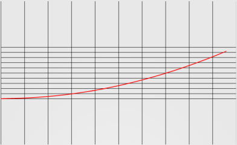

### 属性动画

在Android3.0(API 11)之前，动画只能改变显示，无法响应事件。属性动画有*`ValueAnimator`*、*`ObjectAnimator`*、*`AnimatorSet`*等概念，*`ObjectAnimator`*继承自`*ValueAnimator*`。通过*`nineoldandoids`*可以在API 11之前使用属性动画。

使用*`ObjectAnimator`*控制一个对象的属性，使用多个*`ObjectAnimator`*组合到*`AnimatorSet`*中形成动画,可以动过*`setFrameDelay`*设置动画帧率。

<br>

#### ObjectAnimation

通过*`ObjectAnimator`*的静态工厂类方法创建对象，方法参数为要操作的View、要操作的属性、最后一个参数为该属性变化的一个取值过程(一个可变长数组），该属性必须有get、set函数。还可以通过*`setInterpolator`*设置插值器。

**例：**

```java
    ObjectAnimator animator=ObjectAnimator.ofFloat(view,"translationX",300f);
    animator.setDuration(100);
    animation.start();
```

**注：** 使用*`ValueAnimator`*时，想操作的属性必须有get、set方法，不然*`ValueAnimator`*无法起作用。常用属性动画的属性值:
|属性值|描述|
|---|:--:|
|`translationX`、`translationY`|控制View从它左上角坐标的偏移位置|
|`rotation`、`rotationX`、`rotetaionY`|控制View围绕某点进行2D、3D旋转|
|`scaleX`、`scaleY`|控制View绕某点缩放|
|`pivotX`、`pivotY`|支点的坐标，默认为View中心|
|`x`、`y`|View的最终位置|
|`alpha`|控制透明度，默认1(不透明),0代表完全透明|
<br>

#### 属性动画集合

* 通过*`PropertyValuesHolder`*实现:
**例:**

```java
    PropertyValueHolder ph1=PropertyValueHolder.ofFloat("translationX",300f);
    PropertyValueHolder ph2=PropertyValueHolder.ofFloat("scaleX",1f,0);
    PropertyValueHolder ph3=PropertyValueHolder.ofFloat("scaleY",1f,0);
    ObejctAnimator.ofPropertyValuesHolder(View,ph1,ph2,ph3).setDuration(300).start();
```

* 通过*`AnimationSet`*实现:

```java
    ObjectAnimator animator1=ObjectAnimator.ofFloat(view,"translationX",300f);
    ObjectAnimator animator2=ObjectAnimator.ofFloat(view,"scaleX",1f,0);
    ObjectAnimator animator3=ObjectAnimator.ofFloat(view,"scaleY",1f,0);
    AnimationSet set=new AnimationSet();
    set.setDuration(300);
    set.playTogether(animation1,animation2,animation3);
    set.start();
```

* 通过XML实现：
```xml
    <set android:ordering:["together"|"sequentially"]>
        <objectAnimator
            android:duration="int"
            android:propertyName="String"
            android:valueFrom=["float","int"]
            android:valueTo=["float","int"]
            android:valueType=["intType","floatType"]
            android:repeatMode=["restart","reverse"]
            android:startOffset="int"
            android:repeatCount="int" >
        <animator
            android:duration="int"
            android:valueFrom=["float","int"]
            android:valueTo=["float","int"]
            android:valueType=["intType","floatType"]
            android:repeatMode=["restart","reverse"]
            android:startOffset="int"
            android:repeatCount="int" >
        </objectAnimator>
    </set>
```

`<set>`标签对应*`AnimatorSet`*,`<animator>`相当于*`ValueAnimator`*,`<objectAnimator>`对应*`ObjectAnimator`*。

|标签属性|描述|
|:---:|:--:|
|android:ordering|选项:`together`、`sequentially`,分别代表集合中的子动画同时播放以及依次播放|
|android:duration|动画时长|
|android:valueFrom|属性的起始值|
|android:valueTo|属性的结束值|
|android:valueType|表示android:propertyName所指定的属性的类型，若android:propertyName指定的属性表示颜色，则不需要指定android:valueType|
|android:repeatMode|动画的重复模式|
|android:repeatCount|动画的重复次数|
|android:propertyName|作用对象的属性的名称|

使用XML：

```java
    AnimatorSet set=(AnimatorSet)AnimatorInflater.loadAnimator(Context,R.anim.animator);
    set.setTarget(view);
    set.start();
```

<br>

#### ValueAnimator

*`ValueAnimator`*不作用于任何对象，没有任何动画效果，但可以在动画过程中改变对象的属性值，从而控制动画。*`ValueAnimator`*中的*`AnimatorUpdateListener`*监听数值的变化，从而完成动画的变换。

```java
    ValueAnimator anim=new ValueAnimator.ofFloat(0,100);
    anim.setTarget(view);
    anim.addUpdateListener(new AnimatorUpdateListener(){
        @Override
        public void onAnimationpdate(ValueAnimator anim){
            float value=anim.getAnimatedValue();
        }
    });
    anim.setDuration(1000).start();
```

<br>

#### 动画事件的监听

android提供的Start、Repeat、End、Cancle动画事件的监听接口。
**例：**

```java
    ObjectAnimator anim=new ObjectAnimator.ofFloat(view,"alpha",0.5f);
    anim.addListener(new AnimatorListener(){
        @Override
        public voud onAnimatorStart(){}
        
        @Override
        public voud onAnimatorRepeat(){}
        
        @Override
        public voud onAnimatorEnd(){}
        
        @Override
        public voud onAnimatorCancle(){}        
    });
    anim.start();
```

<br>

#### 插值器和估值器

通过插值器，可以定义动画的变换速率

相关图解：

* AccelerateDecelerateInterpolator:


* AccelerateInterpolator:


* AnticipateInterpolator


* AnticipateOvershootInterpolator


* BounceInterpolator


* CycleInterpolator


* DecelerateInterpolator


* LinearInterpolator


* OvershootInterpolator

